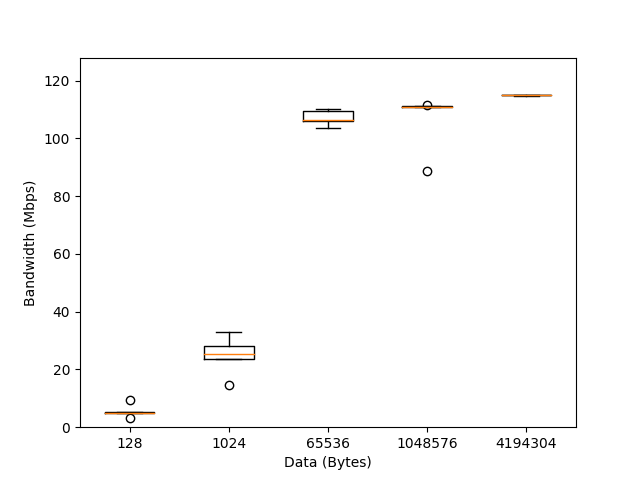

# Assignment 1.1

* The main script is run.py.
* All ploting functions are moduled into another script plot.py, since most of the CSEWS nodes were not having matplotlib.
* Calling statement for plot.py is commented in run.py. So, if matplotlib is installed that one should uncomment it first.
* Might need to recompile the src.c with make command if errors come.
* image.png is the resultant box plot graph.
* data.txt holds the bandwidth values for each iterative runs of the program.
* checkhosts.sh script checks the available hosts in the cluster for running the program.

## Observation

* Mostly bandwidth is increasing w.r.t the size of data we are sending.
* Sometimes it acts different from our expectations because of chances of running scripts from multiple users at the same time on some or all of our nodes.

## Box Plots

## Authors

* **Prashant Piprotar** - - [PrashPlus](https://github.com/prashplus)