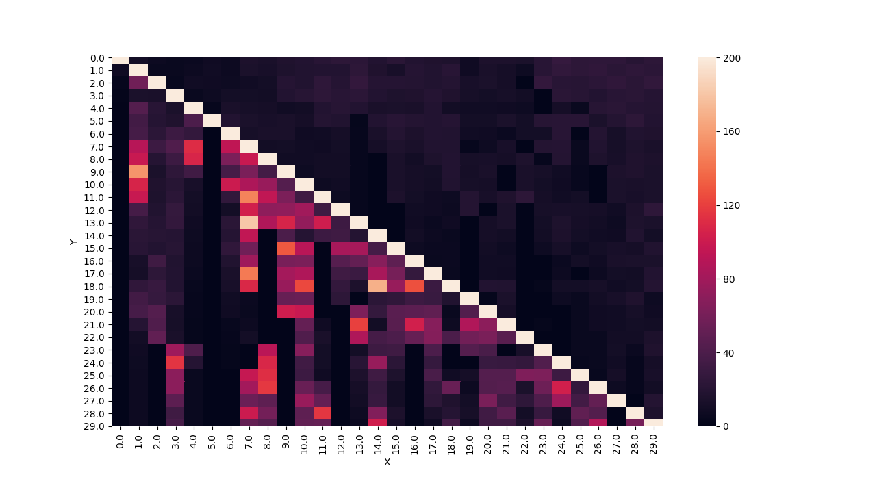
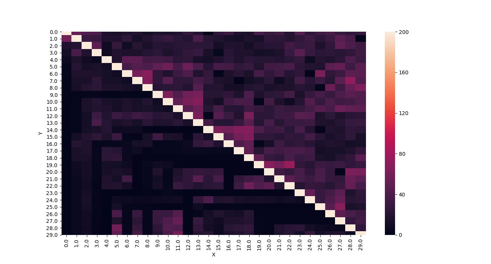
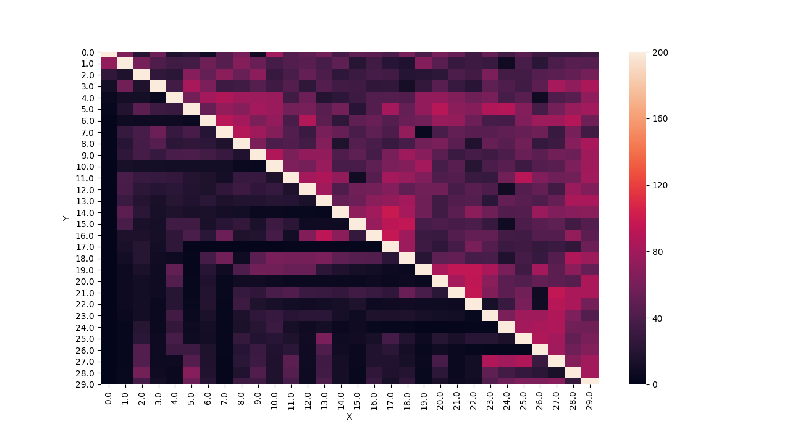

# Assignment 2.1

* The main script is run.py (prefer python3).
* Checkhost script search out all the online nodes from the allhost files and store it in the hosts file.
* Make sure to recomile the source using 'make' before executing it.
* The output data is split into 3 files.
* The command to execute the plot script from run.py is commented. (Uncomment if all the required libraries are present)
* Python multithreading is implemented to increase concurrancy among the jobs.
* The plot files will be generated from the inputs(medians of the values) using plot.py.

## Observations
* By looking at the plots, we can conclude that the as the data size increases the bandwidth increases b/w the nodes, but the when there is intra node communication or transfer it increases exponantially.
* So, the above point can be seen much clearly in the 3rd plot with the diagonal elements to be showing more IO comparing to internode comms, which is making the plot almost dark.

## Plots

### Data Size 64K

### Data Size 512K

### Data Size 2048K

## Authors

* **Prashant Piprotar** - - [PrashPlus](https://github.com/prashplus)