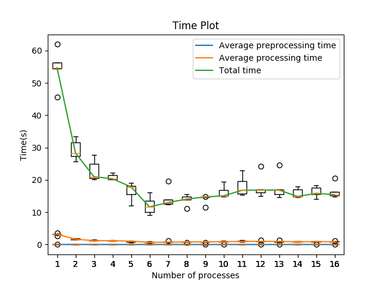
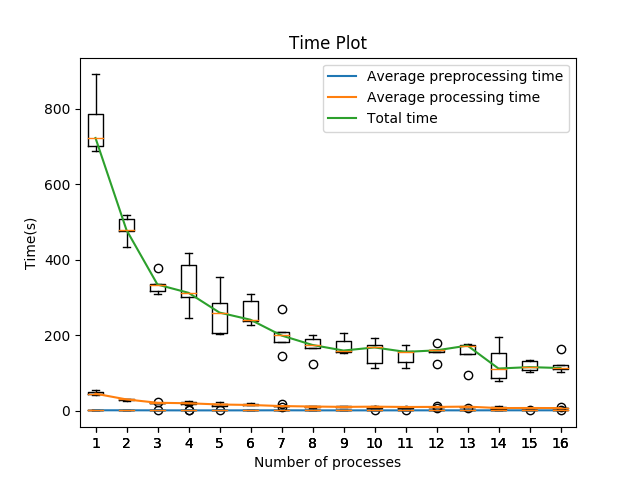
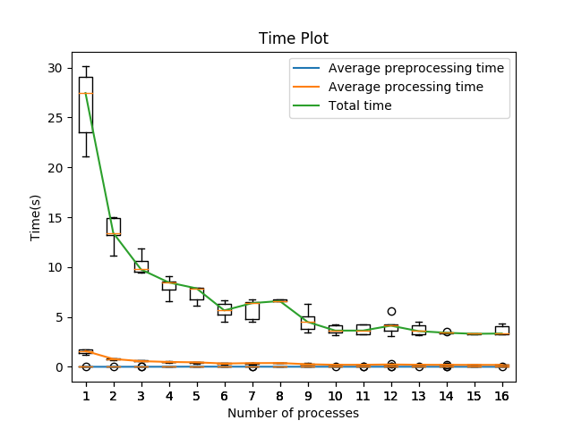
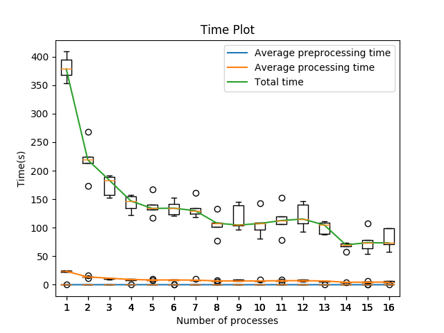

# Assignment 3

## CSE
* The main script is run.py (prefer python3).
* Checkhost script search out all the online nodes from the allhost files and store it in the hosts file.
* Make sure to recomile the source using 'make' before executing it. (make is already there in run.py)
* Suffle the host file before executing, since 1 -30 nodes are usually loading with jobs all the time.
* The command to execute the plot script from run.py is commented. (Uncomment if all the required libraries are present)
* The program is generating 1 output file (time data) per dataset. (for PLOT)
* The plot file cseplot.py is generating 2 graphs, each containing 3 plots.
* Cluster data is saved in cse/data1/* && cse/data2/*

Note: Makefile is for CSE cluster only, for HPC make comand is in the run.sh (not for submitting)
## HPC
* The main script is sub.sh.
* sub.sh compiles the src and then calls hpcrun.py.
* hosts file will be generated which we need to be bother about much.
* The command to execute the plot script from hpcrun1.py or hpcrun2.py is commented. (Uncomment if all the required libraries are present)
* The program is generating 1 output file (time data) per dataset. (for PLOT)
* The plot file hpcplot.py is generating 2 graphs, each containing 3 plots.
* Cluster data is saved in hpc/data1/* && hpc/data2/*

## Observation
### CSE
For the performed run on the CSE cluster, I took ppn 4 as every CPU was having min 4 physical cores. Overall the time for clustering decreases as the number of processes increases which divides the workload and reduces the processing and overall time.
Main thing to notice is that after assigning 6 or more processes the rate of decreasing the processing time reduces.

### HPC 
For the performed run on the HPC cluster, I took ppn 8 as every Node is having min 8 CPU (since each socket is having 4 cores). Same as earlier, the time for clustering decreases as the number of processes increases which divides the workload and decreases the processing time. Assigning 6 or more processes the rate of decreasing the processing time reduces.
Because of the higher ppn and exclusive availability of the node to my job, the program get executed faster over here. But, sometimes if we get lucky and no other jobs were running on the CSE cluster, due to the higher core clocks of the 8th gen coffee lake architecture as compared to Xeon (Nehalem arch) (which prefers more cores than speed) we can get our jobs faster than HPC 2010, but it has very few chance of doing that.

## Plots

## CSE

## HPC

## Authors

* **Prashant Piprotar** - - [PrashPlus](https://github.com/prashplus)